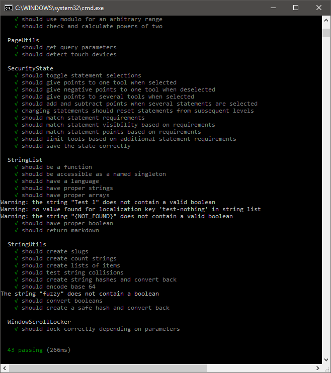
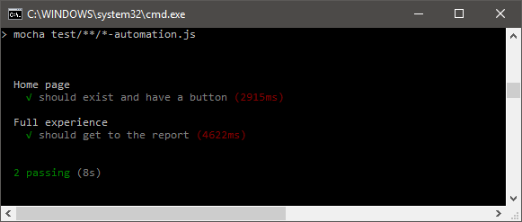
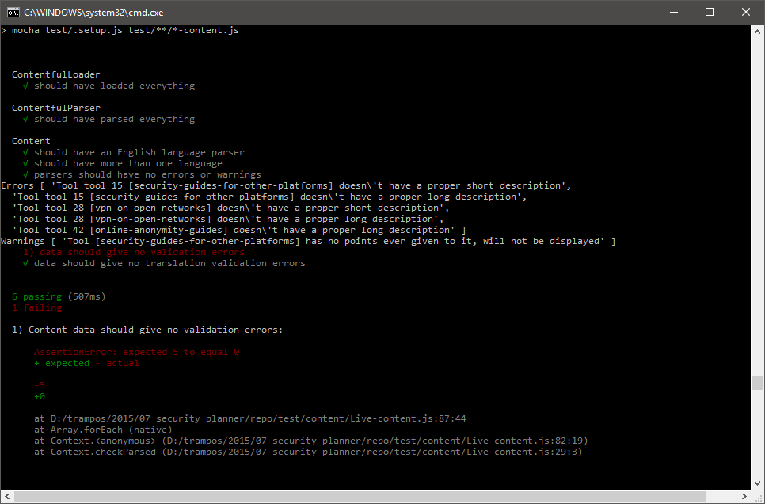
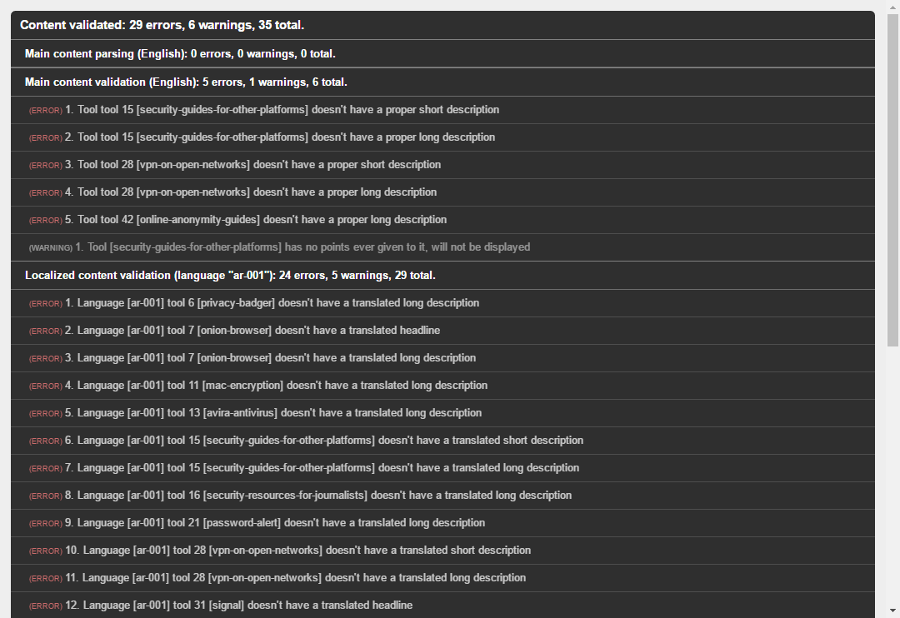

# Security Planner: Testing

As of 03/18/20, the Security Planner test suite has switched to using [Jest](https://jestjs.io/) as a testing framework, using [react-testing-library](https://testing-library.com/docs/intro) for [DOM traversal](https://testing-library.com/docs/dom-testing-library/api-queries) and [event dispatching](https://testing-library.com/docs/dom-testing-library/api-events).


All tests that will run before deployment can be run with:

```shell
    npm run test
```

This executes the basic unit tests along with an end-to-end test done using a [Headless Chrome](https://developers.google.com/web/updates/2017/04/headless-chrome) browser being run with [Selenium](http://www.seleniumhq.org/).

The test results, once generated, will be available in [test-report/](test-report/index.html).

To generate the test coverage report generated by Jest, run:

```shell
    npm run test-coverage
```

This outputs a detailed page which is available at [coverage/lcov-report/](coverage/lcov-report/index.html). Each function that is run using the test suite will be highlighted in this report.

An optional test suite which validate the Contenful data for missing or outdated translations can be run with:

``` shell
    npm run test-content
```

## _WIP_

Snapshot tests are a good way to check that work being done in one component does not change the UI in the application unexpectedly. It does so by saving an object with the rendered component's DOM structure on the first time it runs, and every subsequent test afterwards will check the current output against the saved snapshot.

 _Currently, the snapshot tests are being run on the pages components._

_The Contentful module is still being worked into these snapshot tests and the elements that are expecting strings from Contentful fields will have {NOT_FOUND} inside of them. This would be a good way to validate that there will be no broken text fields once the Contenful data structure is solved for the test suite._

## Introduction

The Security Planner codebase employs different test scripts for different purposes. Depending on which feature is being updated - content or code - different scripts should be used to verify its quality.

## Code Testing

Security Planner employs a suite of test scripts for unit testing aimed at checking the validity of changes done to the code.

During development, and certainly prior to publishing, it is a nice idea to run the unit tests to make sure things are still working as intended.

Assuming the development environment is already prepared and all dependencies installed (if not, check [the development reference](DEVELOPMENT.md)), the basic unit tests are ran via:

```shell
    npm run test
```

This executes our [jest](https://jestjs.io/)-based tests once, printing the results.

[](docs/images/test.png)

All passing tests indicate there's no detected errors.

During development, sometimes it is useful to run the tests continuously - that is, to "watch" the code and re-run the tests as needed. This is done with the following command:

```shell
    npm run test:watch
```

That way, on every script change, the tests are ran again. This helps speed up develpment and testing when a feature is not passing the tests, or when new tests are being developed.

And while the tests are useful to validate the core functionality of the website, it doesn't perform many browser-dependent actions. For that, a separate test category exists: user experience tests ran with [Selenium](http://www.seleniumhq.org/).

To run those, first you need to run the current version of the website locally. Run the dev environment:

```shell
    npm run dev
```

And finally, run the test script on a separate terminal instance:

```shell
    npm run test-ux
```

This will run open a new version of the website, and then try to perform actions on it, selecting statements and getting to the end of the "Action Plan":

[](docs/images/test-ux.gif)

At the end, the window is closed and results are printed:

[](docs/images/test-ux.png)

In the same vein, it can be executed in watch mode:

```shell
    npm run test-ux:watch
```

## Data testing

Since Security Planner's functionality is heavily based around its content, another test category exists: data validation.

The data validation tests can be ran in two ways: via a command line, or via the website itself.

Via command line, it follows the same syntax as our previous tests. Namely:

```shell
    npm run test-content
```

Or:

```shell
    npm run test-content:watch
```

What these tests do is load the site's CMS live data, and perform advanced validation tests in it.

[](docs/images/test-content.png)

It will check for:

* Elements without translated fields
* Elements with important missing fields
* Elements with invalid behavior, such as a Tool that doesn't have points ever given to it

While some of these are classified as "warnings" - that is, the website still works despite not passing them - it is important to make sure the content is as consistent as possible.

The same results can be seen in a browser, by using the Security Planner interface itself for validation. This is done by running the website with a `?validate=1` query parameter, as in:

    http://staging.work.co/gg/sp/20161103/?validate=1

Which will produce this:

[](docs/images/validate-content.png)
